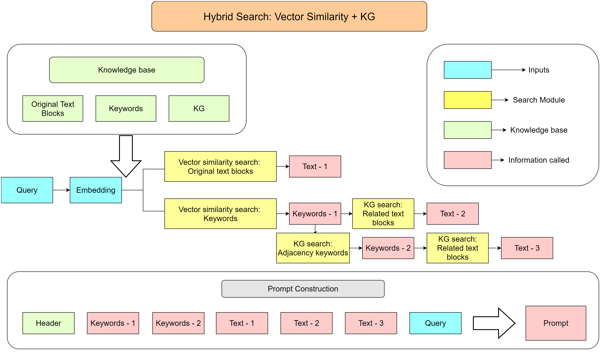
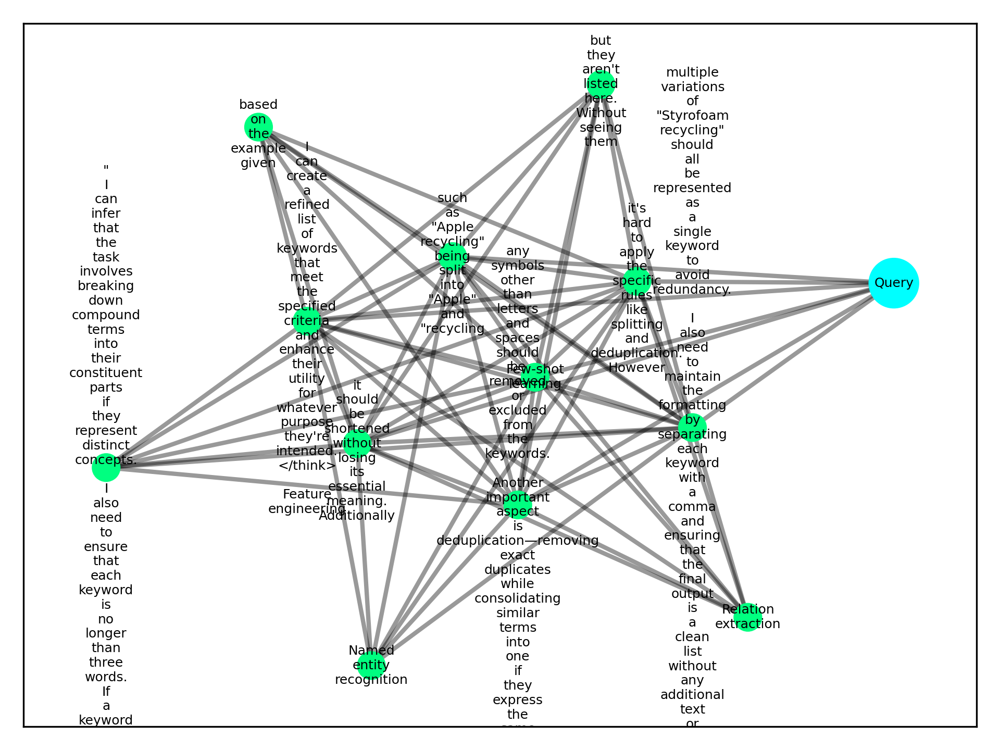

# AutoKG - Efficient Automated Knowledge Graph Generation for Large Language Models

## Background & Motivation

Connecting large language models with specific knowledge bases enhances the accuracy and depth of the model's output.
Currently, knowledge bases are primarily accessed through vector similarity search, which has limitations in retrieving
complex associative information. Knowledge graphs can address these limitations by providing more complex reasoning and
knowledge expansion. However, building and using knowledge graphs is relatively expensive and complex. These challenges
have motivated us to consider a more lightweight approach to constructing knowledge graphs, one that does not require
fine-tuning models or processing the entire corpus while offering the simplicity akin to the vector similarity method.
This line of thinking has led to the development of our AutoKG project.

## Introduction

We present a novel approach to efficiently build lightweight knowledge graphs based on existing knowledge bases,
significantly reducing the complexities involved in leveraging knowledge graphs to enhance language models. Our strategy
involves extracting key terms from the knowledge base and constructing a graph structure on these keywords. The edges in
the graph are assigned a positive integer weight, representing the strength of association between two connected
keywords within the entire corpus. Utilizing this graph structure, we have designed a hybrid search scheme that
simultaneously conducts vector-similarity-based text search and graph-based strongly associated keyword search. All
retrieved information is incorporated into the prompt to enhance the model's response. Please refer to [our paper](https://ieeexplore.ieee.org/abstract/document/10386454)
for more details.

## Flowcharts

Here we use two flowcharts to illustrate our proposed automated KG construction method and mixture search method.

### Keywords Extraction and KG Construction


### Mixture Search: Vector Similarity + KG



## How to Use

1. **Clone the Repository**: `git clone https://github.com/wispcarey/AutoKG.git`
2. **Prerequisites**: Python 3.9 or 3.10
3. **Installation**: Install necessary packages:`pip install -r requirements.txt`
4. **Your OpenAI API key**: Input your openai api key in `config`

## Chat with the Knowledge graph

We offer a concrete example to demonstrate how to construct a knowledge graph using our innovative method. We've
downloaded a collection of research papers (in `raw_data`) related to building knowledge graphs using language models,
and with these papers and our approach, we will show how to create a knowledge graph and use it to reinforce the
performance of Language models.

The example is shown in two main Jupyter Notebooks:

- **`create_KG.ipynb`**: This notebook illustrates how to extract keywords from the selected papers and generate a
  knowledge graph based on these keywords. The entire process is automated, intuitive, and easy to follow.
- **`chat_with_KG.ipynb`**: This notebook provides an example of how to engage in question and answer interactions using
  the knowledge graph we've built. Through this example, users can understand how to apply the constructed knowledge
  graph to real language processing scenarios.

## A chat example

### Query:

> Please tell me how to use pre-trained language models to construct a knowledge graph.

### Subgraph Visualization:

Here is a visualization of the keyword subgraph related to the query. From the query, we search keywords via two steps,
the similarity search and the adjacency search. In the similarity search process, we search some keywords from the
knowledge graph according to the similarity to the query. Then we process the adjacency search, we search more keywords
based on graph weights (which measures the strength of the connection) to those keywords selected by the similarity
search process.

Keywords selected by our two-step search process and their connections are visualized below (green nodes). We only show
whether there is a connection but not the strength of the connection.


Then we select the corpus information passed to the model through the prompt. One part is from the vector similarity to
the query. The other is selected from the related corpus of selected keywords. The subgraph with related corpus nodes (
pink nodes) are visualized below.


### Model (GPT-3.5) Response with KG Information:

>Pre-trained language models (LMs) can be used to construct knowledge graphs (KGs) by leveraging the knowledge stored in the LMs. Here is a step-by-step guide on how to use pre-trained LMs for KG construction:
>
>1. Unsupervised Approach: One approach is to use unsupervised methods like MAMA (designed by Wang et al.) or the method proposed by Hao et al. These approaches involve a single forward pass of the pre-trained LMs over a corpus without any fine-tuning. The LMs generate prompts that express the target relation in a diverse way. The prompts are then weighted with confidence scores, and the LM is used to search a large collection of candidate entity pairs. The top entity pairs obtained from this process are considered as the output knowledge for the KG.
>
>2. Minimal User Input: Another approach, proposed by Hao et al., involves minimal user input. The user provides a minimal definition of the input relation as an initial prompt and some examples of entity pairs. The method then generates a set of new prompts that can express the target relation in a diverse way. Similar to the previous approach, the prompts are weighted with confidence scores, and the LM is used to search a large collection of candidate entity pairs. The top entity pairs obtained from this process are considered as the output knowledge for the KG.
>
>3. In-Context Learning: StructGPT, proposed by Trajanoska et al., allows large language models to reason on KGs and perform multi-step question answering. This approach involves encoding the question and verbalized paths using the language model. Different layers of the language model produce outputs that guide a graph neural network to perform message passing. This process utilizes the explicit knowledge contained in the structured knowledge graph for reasoning purposes.
>
>4. KG Analysis: KGs can also be used to analyze pre-trained LMs. KagNet and QA-GNN, proposed by Trajanoska et al., ground the results generated by LMs at each reasoning step using KGs. This allows for the explanation and analysis of the inference process of LMs by extracting the graph structure from KGs.
>
>5. Distilling Knowledge from LMs: Some research aims to distill knowledge from LMs to construct KGs. COMET proposes a commonsense transformer model that constructs commonsense KGs by using existing tuples as a seed set of knowledge on which to train. The LMs learn to adapt their learned representations to knowledge generation and produce novel tuples that are of high quality.
>
>By following these approaches, pre-trained LMs can be effectively utilized to construct knowledge graphs, which can enhance performance in various downstream applications and provide a powerful model for knowledge representation and reasoning.

## Citation

If you use this tool or data in your research, please cite our paper [IEEE Xplore](https://ieeexplore.ieee.org/abstract/document/10386454):

```bibtex
@inproceedings{chen2023autokg,
  title={AutoKG: Efficient Automated Knowledge Graph Generation for Language Models},
  author={Chen, Bohan and Bertozzi, Andrea L},
  booktitle={2023 IEEE International Conference on Big Data (BigData)},
  pages={3117--3126},
  year={2023},
  organization={IEEE}
}
```

## License

MIT License

Copyright (c) 2023 Bohan Chen

Permission is hereby granted, free of charge, to any person obtaining a copy of this software and associated
documentation files (the "Software"), to deal in the Software without restriction, including without limitation the
rights to use, copy, modify, merge, publish, distribute, sublicense, and/or sell copies of the Software, and to permit
persons to whom the Software is furnished to do so, subject to the following conditions:

The above copyright notice and this permission notice shall be included in all copies or substantial portions of the
Software.

THE SOFTWARE IS PROVIDED "AS IS", WITHOUT WARRANTY OF ANY KIND, EXPRESS OR IMPLIED, INCLUDING BUT NOT LIMITED TO THE
WARRANTIES OF MERCHANTABILITY, FITNESS FOR A PARTICULAR PURPOSE AND NONINFRINGEMENT. IN NO EVENT SHALL THE AUTHORS OR
COPYRIGHT HOLDERS BE LIABLE FOR ANY CLAIM, DAMAGES OR OTHER LIABILITY, WHETHER IN AN ACTION OF CONTRACT, TORT OR
OTHERWISE, ARISING FROM, OUT OF OR IN CONNECTION WITH THE SOFTWARE OR THE USE OR OTHER DEALINGS IN THE SOFTWARE.
